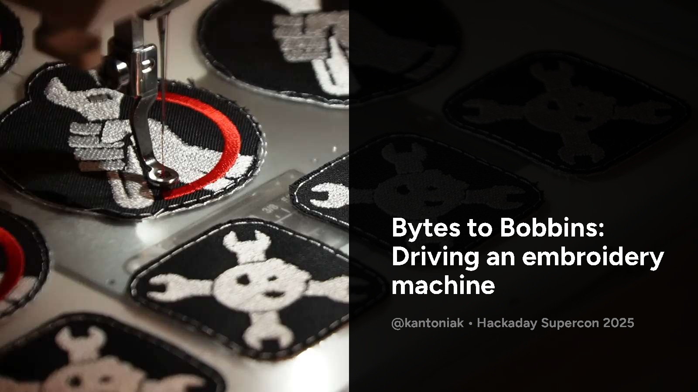

# Bytes to bobbins: Driving an embroidery machine

This repository accompanies the Hackaday Supercon 2025 talk "Bytes to bobbins: Driving an embroidery machine".

  

* [See the recording of the talk](https://www.youtube.com/live/xSH5rNtC45o?si=KRD1u0UKxKyr6JHh&t=100) on Hackaday's YT channel.
* [Download PDF slides](https://github.com/kantoniak/bytes-to-bobbins-talk/releases) from the Releases page.
* [See the demo badge](patch/) made with [Ink/Stitch](https://inkstitch.org/).
* [See code examples](examples/) written with `pystitch`.

## Notes

Thanks for all the comments and questions over the weekend. I'll keep adding more notes and explanations here as they show up. Follow the repo! 😊

* Download and install [Ink/Stitch shortcuts](https://inkstitch.org/docs/customize/#download-and-import-custom-shortcut-keys) in Inkscape. It's a night and day difference.
* Run a tension test when trying new combo of materials. [Good explanation here](https://www.youtube.com/watch?v=TDrrf1ooYLw).
* Even if you use a public access machine, you'll enjoy having personal embroidery scissors (small and angled, like Kai N5100). Mark them "Fabric only".
* Related projects:
  * https://github.com/kantoniak/ba-dum-tshirt
  * https://github.com/kantoniak/sewing-notes

## Acknowledgements

Huge thanks to Spencer, Jad, Cedric and Gab for early feedback!

## License

* The patch is licensed under GPL 3.0, see [patch/LICENSE](patch/LICENSE)
* The code is public domain